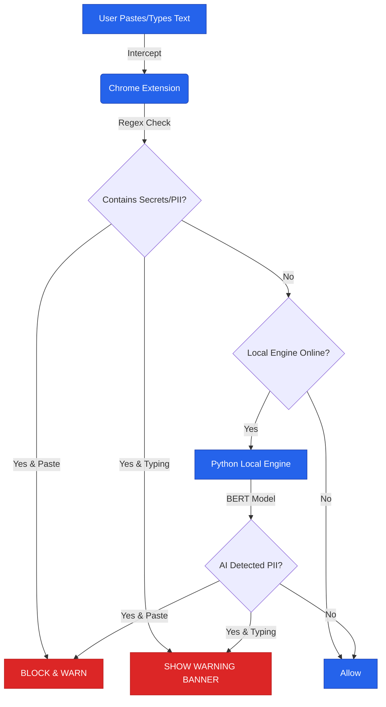

# PrivacyFirewall (Local LLM DLP)

[](https://opensource.org/licenses/MIT)

Local-first PII and secrets firewall for AI tools. Blocks risky paste events, warns while you type, and uses a lightweight on-device AI model—no data leaves your machine.

## Why this project
- Keep human-in-the-loop: stop accidental leaks before they hit third-party AI chats.
- 100% local: content never leaves the browser; optional local API runs on localhost.
- Practical detections: fast regex patterns plus transformer NER for people/orgs/locations.
- Friendly UX: inline warnings, paste-block modal with overrides, status banner for engine health.
- OSS and auditable: minimal stack (MV3 + FastAPI + Hugging Face transformers).

## How it works
- **Chrome extension** (`src/extension`): content script intercepts paste/typing on popular AI chat sites, runs regex checks, and shows the firewall modal. Background worker polls the local engine for health and proxies AI scans.
- **Local engine** (`src/engine`): FastAPI server at `http://127.0.0.1:8765` running the `dslim/bert-base-NER` transformer to flag PII entities. First run downloads the model to `~/.cache/huggingface`; all inference stays local.
- **Fallbacks**: If the engine is offline, regex mode still protects pastes. When online, AI results enhance detection.

### Architecture


## Quickstart (local)
### Prerequisites
- Python 3.10+ (for the engine)
- Chrome/Chromium or Edge (for MV3 extension)
- Git

### 1) Clone
```bash
git clone https://github.com/YOUR-USERNAME/local-llm-dlp.git
cd local-llm-dlp
```
> **Note**: Replace `YOUR-USERNAME` with your GitHub username

### 2) Run the local engine
```bash
cd src/engine
python -m venv .venv
source .venv/bin/activate          # On Windows: .venv\Scripts\activate
pip install --upgrade pip
pip install -r requirements.txt
uvicorn main:app --host 127.0.0.1 --port 8765
```
- First run will download `dslim/bert-base-NER` (~few hundred MB) to `~/.cache/huggingface`.
- You should see `/health` at http://127.0.0.1:8765/health return `{"status": "ok"}`.

### 3) Load the Chrome extension
1. Open `chrome://extensions` (or Edge equivalent) and toggle **Developer mode**.
2. Click **Load unpacked** and select the `src/extension` folder.
3. Pin the extension if you want quick access. The popup is currently a placeholder; the logic lives in the content script.

### 4) Try it
- Visit `chat.openai.com`, `claude.ai`,  or `gemini.google.com`.
- Paste text containing an email, phone number, MAC address, AWS key, or JWT. You should see the firewall modal; choose **Keep Safe** or **Paste Anyway**.
- While typing sensitive patterns, a top-of-page warning banner will appear.

## Detection coverage
- **Regex (instant, offline)**: email, phone number, MAC address, AWS access key, private key header, IP address, credit card number, US SSN, generic API key/hash, JWT.
- **Transformer NER (local AI)**: person names, organizations, locations via `dslim/bert-base-NER` with confidence filtering. Extensible to more models.

## Project layout
```
src/extension/        Chrome MV3 extension (content script, background worker, UI assets)
src/engine/           FastAPI service + transformer model wrapper
src/engine/models/    Model utilities (Hugging Face pipeline)
src/engine/tests/     Basic test harness for detection
```

## Development

### Testing
Run the engine tests to verify detection logic:
```bash
cd src/engine
source .venv/bin/activate  # or .venv\Scripts\activate on Windows
python -m pytest tests/test_comprehensive.py -v
```

### Code Quality
- Linting/formatting: not yet standardized; contributions welcome.
- Model caching: Hugging Face models are cached in `~/.cache/huggingface/`. Delete this directory if you need a clean slate.

## Future ideas
- Add UI settings (enable/disable regex/AI, site allowlist, logs) in the extension popup.
- Expand secret patterns (cloud keys, tokens) and add structured redaction.
- Package the engine as a lightweight binary or container for easier distribution.
- Add CI, linting, and browser-automation tests for regression coverage.

## Troubleshooting
- **“The Engine is Offline”**: Ensure the Python window is still open and running; confirm port 8765 is reachable. The extension will automatically fall back to Regex Mode (basic protection) if the engine is down.
- **“It didn’t block my name”**: Verify the engine is connected (green status in the modal). AI detection is probabilistic (confidence threshold > 0.75), so very short or ambiguous names may pass.

## Contributing
Issues and PRs are welcome. Please include reproduction steps for detection misses and note model versions when reporting false positives/negatives.

## Security and privacy notes
- The extension talks only to `http://127.0.0.1:8765` for AI scans.
- No content is sent to third-party services; all inference is local.
- Review the source and your browser’s network panel to verify behavior.

## License
MIT License. See [LICENSE](LICENSE) for details.

Privacy Note: This software analyzes text on your device. No data is transmitted to the developers or any third party. You can verify this by inspecting the network behavior in `src/extension/content-script.js`.
